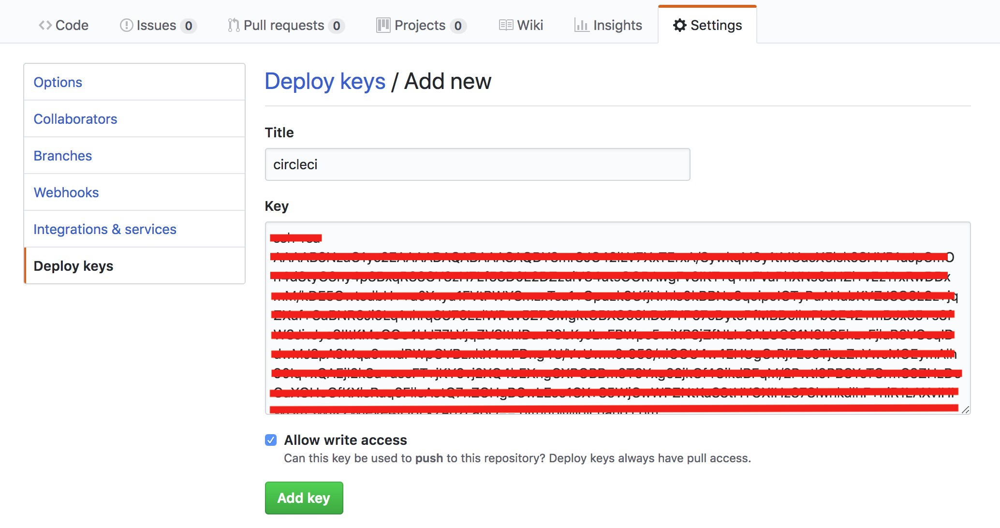
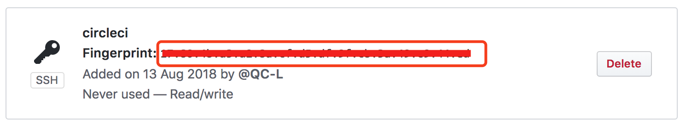

# Simple Circle Shell

1. 将 `simple-circle-ci.sh` 放入项目的根目录中

  ```
  bash simple-circle-ci.sh
  ```

2. 然后，将 `.circleci/deploy_key.pub` 中的内容，添加到 github 仓库的 Setting 中
   
3. 再将 github 生成的 `fingerprint` 填入到 .circleci/config.yml 中的 `enter your key`
   
4. 添加你要执行的 deploy 到 scripts
   ```
      "deploy": "gh-pages -d ./dist"
   ```
5. 将代码上传到 github 中

6. 然后在 circleci 官网中，start building
   此时启动项目构建，会失败。因为官方在 start building 时会在 github 生成一个只读的 key
   需要删除掉 github 只读的 key
7. 在 circleci 网站的项目中添加 `.circleci/deploy_key` 私钥中的内容
8. 重新启动 build 即可
